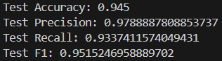

# A model that classifies whether a given image contains Pepe or not

## Performance


## Setting up
Clone this repo and <a href="https://huggingface.co/datasets/vikhyatk/synthetic-pepe">this</a> dataset. Create `notPepe/` and place random images under it. Run `data.py` and then `model.py`.

`data.py` converts images to .png format along with resizing them to 224x224. It splits the images in the following manner-

1) train: 300
2) test: 100
3) validation: 100

By passing `val` as an argument, the model will validate itself after every epoch.

## Architecture(What & Why)
The model is inspired by <a href="https://en.wikipedia.org/wiki/AlexNet">AlexNet</a>. I added batch normalization after every linear layer in the classifier part of the model. That produced this graph:


As you can see the validation graph is very noisy. This often in happens in deep learning models due to batch learning. I removed all batch normalization layer from the model except the one in between the feature and classifier part of the model. If I removed this, the model just wouldn't learn(loss was stuck at 0.69). Now the graph looks like this


## Hyperparameters
```
lr = 0.001
weight_decay = 0.07
momentum = 0.1
batch_size = 16
epochs = 35
```
This part was brute forced with the help of cuda. While training, cuda once complained about being out of memory. I had to reduce `batch_size`, and using functions such as `torch.cuda.empty_cache()` after every epoch, and `torch.no_grad()` while validating and testing my model, to reduce my model's memory usage.

## Training process
`test/`, `train/`, and `val/` each contain 2 directories: `pepe/` and `notPepe/`. Pytorch loads the images under these directories and passes them to a transformer which processes these images before feeding it into the network. The transformer may randomly flip an image vertically. This lets the model genralize more, and prevents overfitting.

I chose the loss function to be Binary Cross Entropy(BCELoss), which is a good loss function for binary classification tasks.  The optimizer chosen is Stochastic Gradient Descent, along with Adam and L2 regularization.

## Results
The testing and training accuracy did not have a high difference, therefore the model fit the data very well without over or under fitting. Testing Accuracy, Precision, Recall and F1 scores were all above 90% supporting my initial claim.

## Failed experiments
* Reduced `lr` after epoch 30, but did not notice any significant improvement.
* Normalized images with `mean = [0.485, 0.456, 0.406]` and `std = [0.229, 0.224, 0.225]`. This reduced the accuracy and made the accuracy graph more noisy.
* Vertical random flips > Horizontal random flips. Increased overall accuracy.

